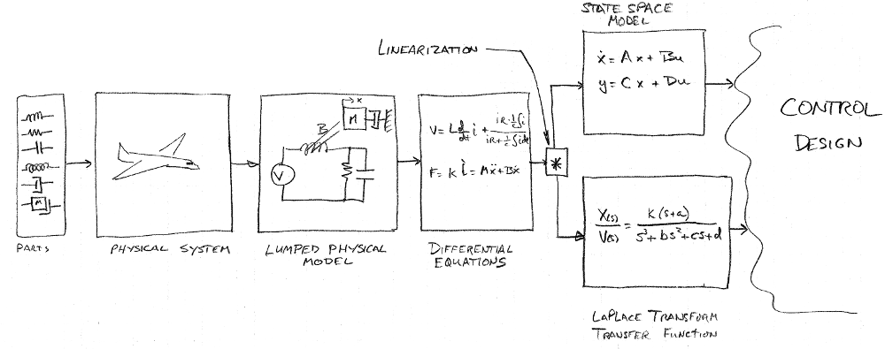

## Introduction to Applied Classical Control

### Blake Hannaford

(Initial Github distribution: August 2019. )

This book evolved from a set of course notes from teaching EE447,
a 10-week course on mostly classical control in the Department of Electrical and Computer Engineering at the University of Washington. My aim in the course was to enable ECE students (mostly Seniors in the Control and Robotics or Energy Systems concentrations) to  master the minimal set of concepts needed to apply  classical control design methods to basic control problems and implement a computer based controller.

The strategy is to focus on a minimal set of concepts, and repeated practice of related skills rather than racing through a comprehensive syllabus. 

Computing is accomplished with the open source Scilab package.  Many engineering programs are based heavily 
on Mathwork's  Matlab software but are considering open source alternatives.  Scilab has the advantage of being close in style and syntax to Matlab.
Python may be a better overall approach, but if they do not have a prior python background, 
and have Matlab exposure from previous courses, Scilab can save a lot of time in a 10 week course.

A basic Scilab script for optimization of PID controllers is provided for numerically driven design.   This allows 
non-traditional aspects of performance such as control effort (addressing actuator saturation) to be factored in. 
Because of the small dimensionality of the controllers designed in this course, 
``brute-force"  optimization is employed.
The power of today's computers make this attractive and avoids extensive 
consideration of starting point and local optima.
Brute force optimization of PID design parameters is
greatly simplified by an initial hand computation.

Problems are provided for active learning.  In teaching the course, I spend about 1/2 the contact
hours on lecture, and the remainder supporting students while they work on the in-class-problems (``ICPs").   Then traditional 
homework problems and exams, done by each student individually,
solidify the knowledge gained. 

Please use branch ``typos'' to fix typos. 

## License

The entire contents of this repository ("Book", "Problems", "Software") 
is licensed under a 
[Creative Commons Attribution-ShareAlike 4.0 International License](http://creativecommons.org/licenses/by-sa/4.0/).

